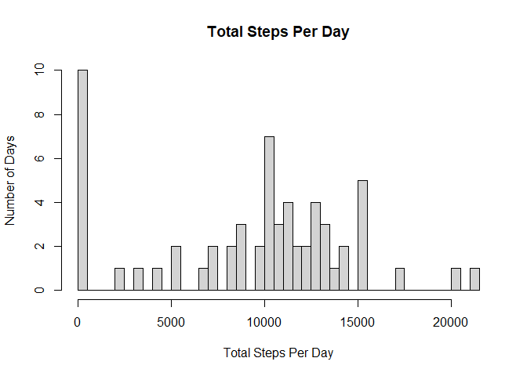
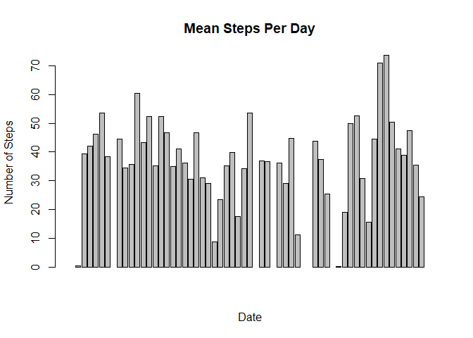
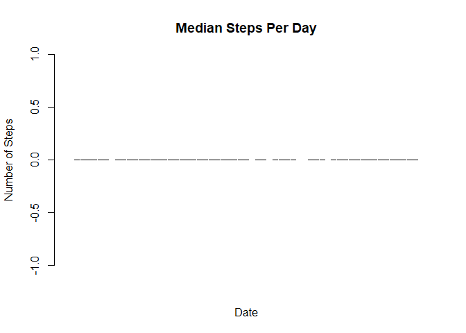
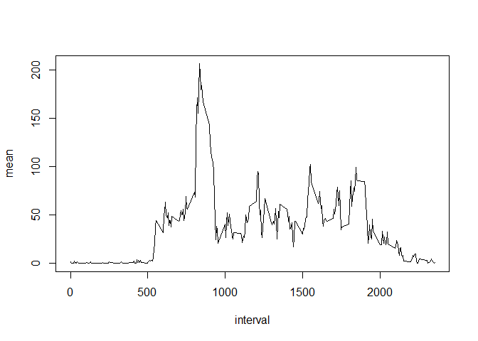
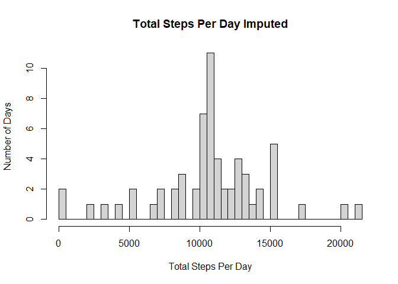
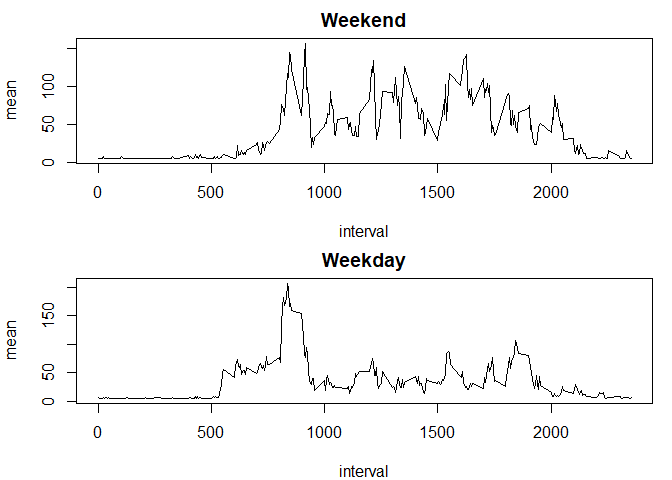

## Loading and preprocessing the data

```r
activity <- read.csv("activity.csv")
# load the packages
library(dplyr)
```

```
## Warning: package 'dplyr' was built under R version 4.2.2
```

```
## 
## Attaching package: 'dplyr'
```

```
## The following objects are masked from 'package:stats':
## 
##     filter, lag
```

```
## The following objects are masked from 'package:base':
## 
##     intersect, setdiff, setequal, union
```

```r
library(ggplot2)
```

```
## Warning: package 'ggplot2' was built under R version 4.2.2
```


## What is mean total number of steps taken per day?

```r
# Use group_by function to group by days and summarise with sum() to count the total steps per day, 
# also, remove na's
steps<-activity%>%
    group_by(date)%>%
    summarise(sum=sum(steps, na.rm = TRUE))

# make a histogram of total steps taken per day using the base plotting system.
# use breaks =61 which equals the number of observations (days) after grouping
hist(steps$sum, breaks = 61, xlab = "Total Steps Per Day", ylab = "Number of Days", main = "Total Steps Per Day")
```

<!-- -->

```r
# Calculate the means for each day using the same approach as for the sum
# show the result using head() function and a barplot
meansteps<-activity%>%
  group_by(date)%>%
  summarise(mean=mean(steps, na.rm = TRUE))
summary(meansteps)
```

```
##      date                mean        
##  Length:61          Min.   : 0.1424  
##  Class :character   1st Qu.:30.6979  
##  Mode  :character   Median :37.3785  
##                     Mean   :37.3826  
##                     3rd Qu.:46.1597  
##                     Max.   :73.5903  
##                     NA's   :8
```

```r
head(meansteps)
```

```
## # A tibble: 6 × 2
##   date          mean
##   <chr>        <dbl>
## 1 2012-10-01 NaN    
## 2 2012-10-02   0.438
## 3 2012-10-03  39.4  
## 4 2012-10-04  42.1  
## 5 2012-10-05  46.2  
## 6 2012-10-06  53.5
```

```r
barplot(meansteps$mean, xlab = "Date", ylab = "Number of Steps", main = "Mean Steps Per Day")
```

<!-- -->

```r
# Calculate the means for each day using the same approach as for the sum
# show the result using head() function and a barplot
mediansteps<-activity%>%
  group_by(date)%>%
  summarise(median=median(steps, na.rm = TRUE))
summary(mediansteps)
```

```
##      date               median 
##  Length:61          Min.   :0  
##  Class :character   1st Qu.:0  
##  Mode  :character   Median :0  
##                     Mean   :0  
##                     3rd Qu.:0  
##                     Max.   :0  
##                     NA's   :8
```

```r
head(mediansteps)
```

```
## # A tibble: 6 × 2
##   date       median
##   <chr>       <dbl>
## 1 2012-10-01     NA
## 2 2012-10-02      0
## 3 2012-10-03      0
## 4 2012-10-04      0
## 5 2012-10-05      0
## 6 2012-10-06      0
```

```r
barplot(mediansteps$median, xlab = "Date", ylab = "Number of Steps", main = "Median Steps Per Day")
```

<!-- -->


## What is the average daily activity pattern?

```r
# Calculate the mean for each interval using group_by and summarise functions
meaninterval<-activity%>%
  group_by(interval)%>%
  summarise(mean=mean(steps, na.rm = TRUE))

# Plot the results using a line plot (type "l"), then find the position of the maximum value and print it out
with(meaninterval, plot(interval, mean, type = "l"))
```

<!-- -->

```r
which.max(meaninterval$mean)
```

```
## [1] 104
```

```r
meaninterval[104,]
```

```
## # A tibble: 1 × 2
##   interval  mean
##      <int> <dbl>
## 1      835  206.
```


## Imputing missing values

```r
# Calculate and report the total number of missing values (only the rows from the steps column have NA's)
sum(is.na(activity$steps))
```

```
## [1] 2304
```

```r
# Calculate the mean steps taken from the whole dataset
activity_mean<-mean(activity$steps, na.rm = TRUE)

# Use the mean steps value to replace the missing values
activity_impute_steps<-replace(activity$steps, is.na(activity$steps),activity_mean)
activity_impute<-mutate(activity, steps=activity_impute_steps)

# make a histogram of total steps taken per day after imputing the data
# use breaks =61 which equals the number of observations (days) after grouping
steps_impute<-activity_impute%>%
  group_by(date)%>%
  summarise(sum=sum(steps))
hist(steps_impute$sum, breaks = 61, xlab = "Total Steps Per Day", ylab = "Number of Days", main = "Total Steps Per Day Imputed")
```

<!-- -->


## Are there differences in activity patterns between weekdays and weekends?

```r
# Use the as.Date and weekdays functions to change the dates into day names
# afterwards use the ifelse function to change the day names into either Weekend or Weekday

activity_date<-activity_impute %>%
  mutate(date = as.Date(date, format="%Y-%m-%d")) %>%
  mutate(day_of_the_week=weekdays(date)) %>%
  mutate(day_of_the_week=ifelse(day_of_the_week %in% c("Saturday", "Sunday"), "Weekend", "Weekday"))

# Calculate the means for each interval on weekdays and weekends
meaninterval_week<-activity_date %>%
  group_by(interval,day_of_the_week) %>%
  summarise(mean=mean(steps, na.rm = TRUE))
```

```
## `summarise()` has grouped output by 'interval'. You can override using the
## `.groups` argument.
```

```r
# then show a plot for the mean number of steps in each interval on Weekends and Weekdays
par(mfrow = c(2, 1),mar = c(4, 4, 2, 1))
with(subset(meaninterval_week, day_of_the_week== "Weekend"), plot(interval, mean, type = "l", main="Weekend"))
with(subset(meaninterval_week, day_of_the_week== "Weekday"), plot(interval, mean, type = "l", main="Weekday"))
```

<!-- -->
